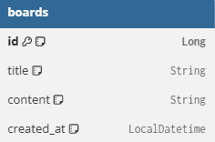
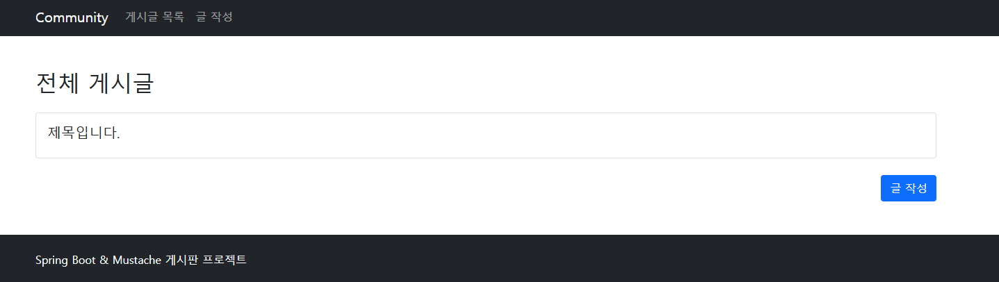
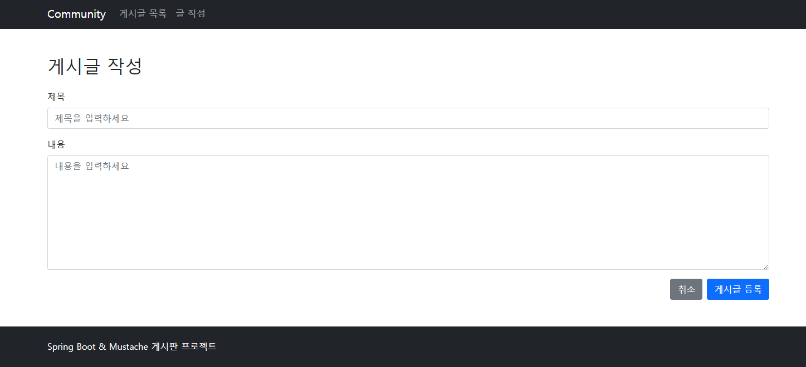
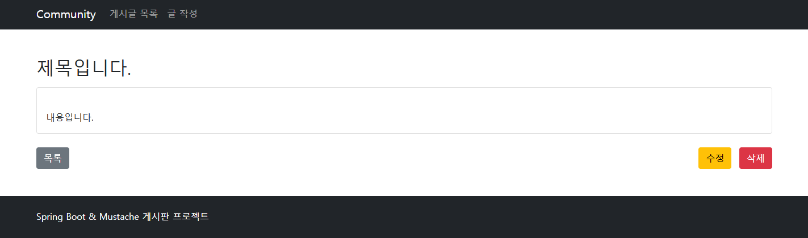

# 📝Community Board (Spring Boot 게시판)

Spring Boot와 JPA를 활용한 **기본 CRUD 게시판 프로젝트**입니다.  
게시글 생성, 조회, 수정, 삭제 기능을 구현하며 MVC 구조와 DTO → Entity 흐름을 학습하는 것을 목표로 합니다.

## 🛠 기술 스택

| 구분              | 기술              |
| --------------- | --------------- |
| Language        | Java 17         |
| Framework       | Spring Boot     |
| ORM             | Spring Data JPA |
| DB              | H2 (In-Memory)  |
| Template Engine | Mustache        |
| Build Tool      | Gradle          |
| IDE             | IntelliJ IDEA  |

## 📂 패키지 구조

com.example.community  
 ├─ controller  
 │   └─ BoardController  
 ├─ dto  
 │   └─ BoardForm  
 ├─ entity  
 │   └─ Board  
 └─ repository  
     └─ BoardRepository  

## 📄주요 기능

- 게시글 작성

- 게시글 전체 조회

- 게시글 상세 조회

- 게시글 수정

- 게시글 삭제
  

  
## 📌 ERD

`boards` 테이블은 게시판의 게시글 정보를 저장하는 테이블이다.  
각 게시글은 고유한 식별자인 `id`를 기본 키(PK)로 가지며, 게시글의 제목(`title`), 내용(`content`), 생성 시간(`created_at`)으로 구성되어 있다.

`id`는 자동 증가 방식으로 생성되며, `created_at` 컬럼은 게시글이 최초 저장될 때 `@PrePersist`를 통해 자동으로 현재 시간이 저장된다.  

본 프로젝트에서는 게시글 중심의 CRUD 기능 구현을 목표로 하여 단일 테이블 구조로 설계하였다.

## 🔗 URL 매핑 정리

| 기능       | HTTP Method | URL                   |
| -------- | ----------- | --------------------- |
| 글 작성 페이지 | GET         | `/boards/new`         |
| 글 생성     | POST        | `/boards/create`      |
| 전체 글 조회  | GET         | `/boards`             |
| 글 상세 조회  | GET         | `/boards/{id}`        |
| 글 수정 페이지 | GET         | `/boards/{id}/edit`   |
| 글 수정     | POST        | `/boards/update`      |
| 글 삭제     | GET         | `/boards/{id}/delete` |

## 📌프로젝트 실행화면

📌메인 페이지

📌게시글 작성 페이지

📌게시글 상세 페이지

### 📌 BoardController

- 게시판의 CRUD 요청을 처리하는 컨트롤러

- `BoardForm(DTO)` → `Board(Entity)` 변환 후 DB 저장

- Redirect 방식을 사용하여 중복 요청 방지

### 📌 BoardForm (DTO)

- 클라이언트 요청 데이터를 담는 객체

- `toEntity()` 메서드를 통해 Entity로 변환

`public Board toEntity(){    return new Board(id, title, content); }`

### 📌 Board (Entity)

- 게시글 정보를 저장하는 JPA 엔티티

- `@PrePersist`를 활용해 게시글 생성 시간 자동 저장

`@PrePersist public void prePersist(){    this.createdAt = LocalDateTime.now(); }`

### 📌 BoardRepository

- `CrudRepository` 상속

- 기본 CRUD 메서드 제공 (`save`, `findAll`, `findById`, `delete`)

## 🎯 학습 포인트

- Spring MVC 요청 흐름 이해

- DTO와 Entity 분리의 필요성

- JPA 기반 CRUD 처리

- Redirect와 Model 활용

- Mustache 템플릿 구조 이해
